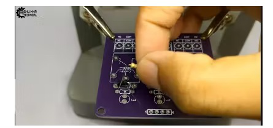

{width="0.5236111111111111in"
height="0.5847211286089239in"}

**instructables**

{width="0.5097222222222222in"
height="0.5097211286089239in"}

> by
>
> This is a very advantageous yet easy to make project. We call it \"
> Smart Electric Board\".

{width="7.477777777777778in"
height="5.669444444444444in"}

> **Step 1: Story**
>
> This is a very advantageous yet easy to make project.

**We call it \" \". \".**

Smart Electric Board: Page 1

**Bene�ts** :-

This device is extremely convenient and a�ordable. You can make this
device for your o�ce as well as for your home also.

> This device will make your life way easier. By using this **,,** you
> will be no longer dealing with thosehassling wires. By using this
> Smart device, you can switch o� lights or fans without moving from
> your position which will save your energy and electric bills. So, This
> device is also a powerful Energy-saving Solution.
>
> By following this guide, you will be able to know and make your **..**
> This project guide contains the
>
> �les necessary to help you step by step produce your own Please follow
> the steps of the project
>
> to get a positive result.
>
> **Step 2: Get Your PCB Ready**

**Talking about electronics**

{width="0.1388888888888889in"
height="0.1388888888888889in"}

> After making the circuit diagram I transformed it into a PCB design to
> produce it, to produce the PCB, I have chosen the best PCB supplier
> and the cheapest PCB provider to order my circuit. with
> the{width="7.527777777777778in"
> height="0.6944444444444444in"}{width="7.527777777777778in"
> height="0.8888888888888888in"}
>
> reliable platform, all I need to do is some simple clicks to upload
> the Gerber �le and set some parameters like the PCB thickness color
> and quantity. I've paid just 2 Dollars to get my PCB after �ve days
> only, what I have noticed about this time is the \"out-of-charge PCB
> color\" which means you will pay only 2USD for any PCB color you
> choose.

**Related Download Files**\
As you can see in the pictures above the PCB is very well manufactured
and I've got the same PCB design that we've made for our main board and
all the labels and logos are there to guide me during the soldering
steps. You can also download the Gerber �le for this circuit from the
download link below in case you want to place an order for the same
circuit design.

Smart Electric Board: Page 2

{width="7.477777777777778in"
height="3.875in"}

{width="7.477777777777778in"
height="3.6236100174978128in"}

Smart Electric Board: Page 3

{width="7.477777777777778in"
height="3.8472222222222223in"}

**Step 3: Place All the Components on the PCB and Soldier It Properly**

{width="7.477777777777778in"
height="4.004166666666666in"}

Smart Electric Board: Page 4

{width="7.477777777777778in"
height="3.5277777777777777in"}

{width="7.477777777777778in"
height="3.813888888888889in"}

Smart Electric Board: Page 5

{width="7.477777777777778in"
height="3.459722222222222in"}

{width="7.477777777777778in"
height="3.7666655730533685in"}

**Step 4: Now, We Will Make a Electric Board**

Smart Electric Board: Page 6

{width="7.477777777777778in"
height="3.875in"}

{width="7.477777777777778in"
height="4.208333333333333in"}

Smart Electric Board: Page 7

{width="7.477777777777778in"
height="4.398611111111111in"}

**Step 5: We Will Connect All These Sockets to Each Other.**

{width="0.1388888888888889in"
height="0.1388888888888889in"}

> We will take one point common from each socket whose input will be
> connected to main power supply. And, We will connect one-one wire to
> empty point of each socket which will connect to our Relay module.
>
> A power supply wire will be connected to one point of switch.

Smart Electric Board: Page 8

{width="7.477777777777778in"
height="4.173611111111111in"}

**Step 6: Now, We Will Connect Our Module to the Board.**

{width="0.1388888888888889in"
height="0.1388888888888889in"}

{width="0.1388888888888889in"
height="0.3611111111111111in"}

{width="0.1388888888888889in"
height="0.1527777777777778in"}

> We will take one point common in our module same as we have done in
> extension board.
>
> In second point, we will connect our extra wires that we have drawn
> out from the extension board. And the common wire will connect to one
> of the point of switch.
>
> We will connect one wire of main supply to common point of socket and
> second wire to empty point of switch.
>
> Now, We will connect our RGB controller to module and we will use 12
> volt adaptor (circuit) for power supply.
>
> We will connect this circuit to the main supply.

Smart Electric Board: Page 9

{width="7.477777777777778in"
height="3.8958333333333335in"}

{width="7.477777777777778in"
height="4.030555555555556in"}

Smart Electric Board: Page 10

{width="7.477777777777778in"
height="3.9763888888888888in"}

{width="7.477777777777778in"
height="4.011111111111111in"}

Smart Electric Board: Page 11

{width="7.477777777777778in"
height="3.834722222222222in"}

**Step 7: Stick the Circuit to Your Custom Designed Box With the Help of
Glue Gun.**

{width="7.477777777777778in"
height="4.372222222222222in"}

Smart Electric Board: Page 12

{width="7.527777777777778in"
height="0.2777777777777778in"}

> **Step 8: Cover the Box and Place All the Components of PCB on Their
> Respective Holes or Places.**
>
> **Now your ownis ready to use.**

{width="7.477777777777778in"
height="4.1in"}

> **Step 9: Testing :-**
>
> For testing purpose I am using 220 watt bulbs of di�erent colors. As
> you can see below in the images that we can operate our board with the
> use of our remote. Our works well. Now, we can attach it with our
> prototype.
>
> **New users will also get some coupons while registering atvia this
> blue link.**

Smart Electric Board: Page 13

{width="7.477777777777778in"
height="4.0375in"}

{width="7.477777777777778in"
height="4.3180555555555555in"}

Smart Electric Board: Page 14

{width="7.477777777777778in"
height="4.058333333333334in"}

Smart Electric Board: Page 15
